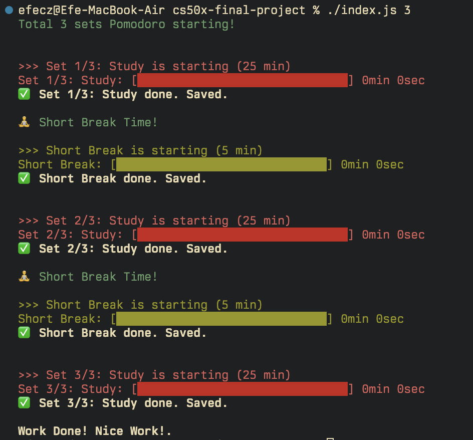

# Pomodoro CLI Timer

A command-line interface (CLI) tool designed for developers who want to maintain focus and productivity directly from their terminal. It combines the Pomodoro Technique with visual progress bars, native desktop notifications, audio alerts, and automated session logging.

---




---

## ✨ Features

- **⚡ CLI-First Experience:** No need to leave your terminal or open heavy GUI applications.

- **📊 Visual Progress Bar:** A custom ASCII-based progress bar that updates in real-time without cluttering the console history (uses `process.stdout` and carriage returns).

- **🔔 Native Desktop Notifications:** Sends system-level notifications (macOS/Windows/Linux) when a session ends, ensuring you never miss a break even if the terminal is in the background.

- **🔊 Audio Alerts:** Plays distinct sound cues for "Work Mode" and "Break Mode" to create a Pavlovian focus response.

- **📝 Automated Logging:** Every completed session is automatically saved to a `history.csv` file with timestamps, allowing you to track your productivity over time.

- **🎨 Smart Coloring:** Uses ANSI color codes to visually distinguish between Work (Red), Short Break (Green), and Long Break (Green) states.

- **🔄 Auto-Session Management:** Automatically handles the logic for Short Breaks (5 min) vs. Long Breaks (25 min) based on the standard Pomodoro flow (4 sets = 1 long break).

---

## 🚀 Installation

### Prerequisites

You must have **Node.js** installed on your machine.

**Download Node.js:** [nodejs.org](https://nodejs.org)

### Step-by-Step Guide

1. **Clone the Repository**

```bash
git clone https://github.com/efecihanzengin/cs50x-final-project.git
cd cs50x-final-project
```

2. **Install Dependencies**

This project uses `node-notifier` for notifications and `play-sound` for audio. Install them via npm:

```bash
npm install
```

3. **Setup Audio Files**

Ensure that `mola_vakti.wav` and `is_vakti.wav` are present in the root directory. You can replace these with any `.wav` or `.mp3` files of your choice.

---

## 💻 Usage

To start the application, navigate to the project directory in your terminal.

### The Command

The tool accepts one argument: the number of sessions (sets) you want to complete.

```bash
./index.js <number_of_sets>
```

**(Note: If you are on Windows, use `node index.js <number_of_sets>`)**

---

## 💡 Examples

Here are a few scenarios on how to use the timer effectively:

### Scenario 1: The "Deep Work" Session (Recommended)

You want to commit to a full block of work. This will run 4 Pomodoro sets with short breaks in between, and finish with a Long Break.

```bash
./index.js 4
```

**Flow:**
1. Work (25m) → Short Break (5m)
2. Work (25m) → Short Break (5m)
3. Work (25m) → Short Break (5m)
4. Work (25m) → Long Break (25m) → Finish 🏁

### Scenario 2: The "Quick Fix"

You just want one focused session before a meeting.

```bash
./index.js 1
```

**Flow:**
- Work (25m) → Finish 🏁 (No break required as the task is done)

### Scenario 3: The "Marathon"

For intense study days where you plan multiple cycles.

```bash
./index.js 8
```

**Flow:**
Runs two full cycles of the Pomodoro technique (Work-Break x4 → Long Break → Repeat).

---

## 🏗️ Design Choices & Technical Implementation

Creating a seemingly simple timer involves several architectural decisions to ensure accuracy and a good user experience.

### Why Node.js?

While C is powerful, managing asynchronous events (like timers awaiting completion while listening for interrupts) and handling cross-platform system calls (like audio and notifications) is significantly more streamlined in Node.js. The Event Loop architecture of Node.js is perfect for this kind of I/O-heavy, non-blocking application.

### The async/await Pattern

Instead of "callback hell" or complex `setTimeout` nesting, I utilized modern JavaScript ES6 `async/await` syntax.

- The `startTimer` function returns a **Promise** that resolves only when the time is up.
- This allows the main loop to pause execution cleanly (`await startTimer(...)`) without freezing the entire application process, maintaining code readability and flow control similar to synchronous code.

### Visual Rendering (process.stdout)

A standard `console.log` prints a new line for every output, which would flood the terminal window during a countdown.

**Solution:** I used `process.stdout.write` combined with the `\r` (Carriage Return) character. This moves the cursor back to the beginning of the line, allowing the progress bar to overwrite itself every second, creating a smooth animation effect.

### Data Persistence (CSV)

I chose **CSV** (Comma Separated Values) for the log file (`history.csv`) instead of a database (like SQLite) or JSON.

**Reasoning:** CSV is human-readable, lightweight, and can be directly opened in Excel or Google Sheets for data analysis without requiring any external database engine.

---

## 📂 Project Structure

```
.
├── index.js          # The main entry point containing the application logic
├── package.json      # Manages project dependencies
├── history.csv       # Automatically generated file storing session logs
├── mola_vakti.wav    # Break time audio alert
└── is_vakti.wav      # Work time audio alert
```

---

## 🤝 Contributing

Contributions are welcome! If you have ideas for features (e.g., a "Pause" button or customizable durations via flags), feel free to fork the repo and submit a pull request.

---

## 📄 License

This project is open-source and available under the **MIT License**.